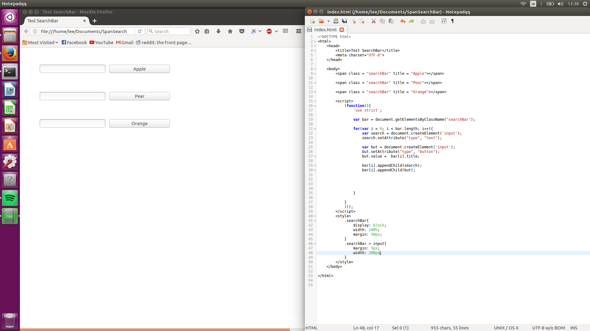

# PseudoObjectsJS
A way to cut down on the amount of code you need to type by creating multiple searchbars but only writing the code for it once.

Here is an example where you only have to write the span attribut but it will write all the searchbars for you:

